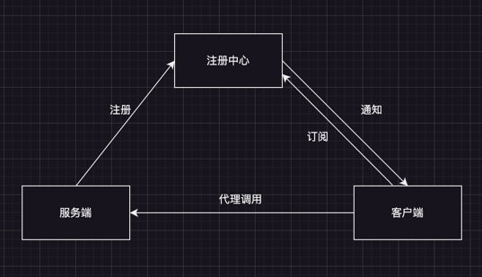
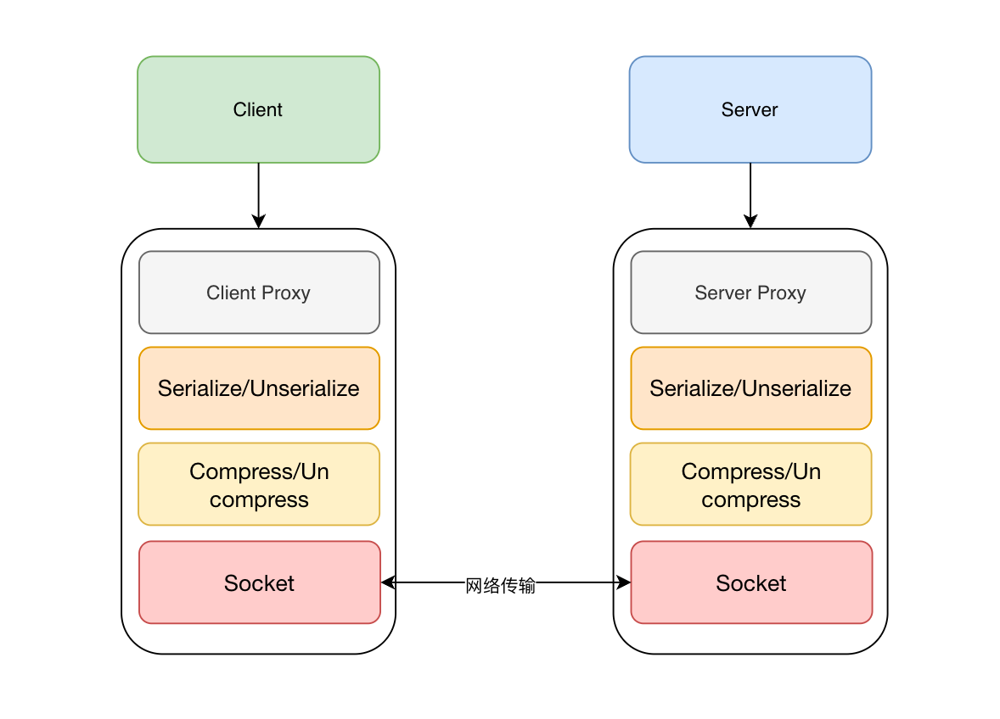

# micro-rpc

## 项目简介

本项目是为了学习类似于`Dubbo`这样的`RPC`框架而诞生;由于`Dobbo`的源码文档过于复杂，学习起来比较困难。但是`Dubbo`最核心的还是服务通信所以就尝试一下自己实现一个简单的服务调用；先把最基本的功能完善掉，然后再去学习`Dubbo`

## Apache Dubbo介绍
Apache Dubbo 是一个流行的开源、高性能、多功能的 RPC（远程过程调用）框架; 它专为构建分布式系统和微服务架构而设计。Dubbo 提供了一个远程方法调用框架，可以简化分布式服务之间的通信; 它抽象了底层网络通信，并为开发人员提供了干净的API。Dubbo 以其卓越的性能特点而闻名， 它结合了连接池、线程池管理和序列化优化等功能，以确保低延迟和高吞吐量。Dubbo 支持各种负载均衡策略，在多个服务提供商之间分配流量， 这有助于提高系统的可靠性和可扩展性。 Dubbo提供服务注册和发现机制，服务提供者向注册表（例如 ZooKeeper 或 etcd）注册其服务，消费者可以从注册表中发现可用的服务。 Dubbo提供了重试失败请求、熔断、减载等容错机制，以增强分布式系统的健壮性。Dubbo 允许您动态修改配置，而无需重新启动系统。 这种灵活性在微服务环境中非常有价值。 Dubbo 具有可插拔架构，允许您根据需要使用序列化协议、通信协议、注册中心等不同组件。Dubbo 内置了对监控和管理的支持， 您可以通过 Dubbo 管理控制台收集指标、跟踪请求并管理服务。虽然 Dubbo 主要基于 Java，但它支持与其他语言（如 Python、Ruby 等）编写的服务进行通信。Dubbo 拥有庞大且活跃的社区，使其维护良好并不断发展。 要使用 Apache Dubbo，您可以浏览[ Dubbo 社区](https://cn.dubbo.apache.org/zh-cn/overview/home/)提供的文档和教程。 


## RPC简要介绍
RPC（Remote Procedure Call）远程过程调用，是一种进程间通信方式。它允许一个进程调用另一个进程中的过程，而像似调用本地过程一样。

RPC 的整体系统架构图大致如下：



图中服务端启动时将自己的服务节点信息注册到注册中心， 客户端调用远程方法时会订阅注册中心中的可用服务节点信息，拿到可用服务节点之后
远程调用方法，当注册中心中的可用服务节点发生变化时会通知客户端，避免客户端继续调用已经失效的节点；客户端远程调用示意图：


1.将目标服务、目标方法、调用目标方法的参数等必要信息序列化
2.序列化之后的数据包进一步压缩，压缩后的数据包通过网络通信传输到目标服务节点
3.服务节点将接受到的数据包进行解压
4.解压后的数据包反序列化成目标服务、目标方法、目标方法的调用参数
5.通过服务端代理调用目标方法获取结果，结果同样需要序列化、压缩然后回传给客户端

## RPC实现
#### 服务注册
网上盛行注册中心有很多，例如`zookeeper`、`consul`、`eureka`等，本项目将采用`Zookeeper`作为注册中心，`ZooKeeper` 将数据保存在内存中，性能很高。        
`Zookeeper`是一个典型的CP系统，在服务选举或者集群半数机器宕机时是不可用状态，相对于服务发现中主流的AP系统来说，可用性稍低，但是用于理解RPC的实现，也是绰绰有余。为了方便操作我们采用`zkclient`来注册服务，`zkclient`是`Zookeeper`的java客户端，它提供了一个高级别的抽象来简化`Zookeeper`的操作。`zkclient`的API设计非常简单，它提供了`ZkClient`、`ZkConnection`、`ZkClientConfig`、`ZkNodeProps`等类，`ZkClient`是客户端的核心类，`ZkConnection`是连接，`zookeeper`的底层类，`ZkNodeProps`是`zookeeper`节点属性类。`ZkClientConfig`是配置类，它提供了一个构造器，可以指定`zookeeper`的连接地址和超时时间。

**zkclient依赖：**
```xml
<dependency>
    <groupId>com.101tec</groupId>
    <artifactId>zkclient</artifactId>
    <version>0.10</version>
</dependency>
```
**示例代码**
```java
public class ZoomKeeperRegisterCenter implements IRegisterCenter {

    //....

    private void registerService(ServiceInstance serviceInstance) {
        String applicationName = rpcConfig.getApplication().getName();
        //根节点
        String servicePath = "/rpc/" + applicationName + "/service";
        if (!zkClient.exists(servicePath)) {
            //没有就注册
            zkClient.createPersistent(servicePath, true);
        }

        String urlInfo = serviceInstance.getIp() + ":" + serviceInstance.getPort() + JSON.toJSONString(serviceInstance.getRegisterData());
        String uri;
        try {
            uri = URLEncoder.encode(urlInfo, "UTF-8");
        } catch (UnsupportedEncodingException e) {
            throw new RuntimeException(e);
        }

//        注册子服务节点
        String uriPath = servicePath + "/" + uri;
        //同一个service可能有多个版本的实现，所以可能已经被注册到注册中心，这样就不需要注册了
        if (!zkClient.exists(uriPath)) {
            //创建一个临时节点，会话失效即被清理
            zkClient.createEphemeral(uriPath);
            //发布的URI记录到map里，方便关机取消注册
//            ExportedServiceURI.add(uriPath);
            log.info("service :{} exported zk", uriPath);
        }

    }
    //....
}
```
注册流程分为
- [x] 注册服务提供者
- [x] 本地服务缓存
- [x] 注册服务调用者信息
- [ ] 监听节点变化，刷新服务提供者信息

## 网络通信
在Java领域，`Netty` 的领衔地位短时间内无人能及。所以选用 Netty 作为网络通信的基础框架。
**序列化和反序列化**
序列化与反序列化的核心作用就是对象的保存与重建，方便客户端与服务端通过字节流传递对象，快速对接交互。

序列化就是指把对象转换为字节序列的过程。
反序列化就是指把字节序列恢复为对象的过程。
Java序列化的方式有很多，诸如 JDK 自带的 Serializable 、 Protobuf 、 kryo 等，本项目采用Protobuf进行序列化和反序列化操作

**示例代码**
```java
public class SerializationUtil {

    private static Map<Class<?>, Schema<?>> cachedSchema = new ConcurrentHashMap<>();

    private static Objenesis objenesis = new ObjenesisStd();

    private SerializationUtil() {

    }

    /**
     * 序列化(对象 -> 字节数组)
     *
     * @param obj 对象
     * @return 字节数组
     */
    public static <T> byte[] serialize(T obj) {
        Class<T> cls = (Class<T>) obj.getClass();
        LinkedBuffer buffer = LinkedBuffer.allocate(LinkedBuffer.DEFAULT_BUFFER_SIZE);
        try {
            Schema<T> schema = getSchema(cls);
            return ProtostuffIOUtil.toByteArray(obj, schema, buffer);
        } catch (Exception e) {
            throw new IllegalStateException(e.getMessage(), e);
        } finally {
            buffer.clear();
        }
    }

    /**
     * 反序列化(字节数组 -> 对象)
     *
     * @param data
     * @param cls
     * @param <T>
     */
    public static <T> T deserialize(byte[] data, Class<T> cls) {
        try {
            T message = objenesis.newInstance(cls);
            Schema<T> schema = getSchema(cls);
            ProtostuffIOUtil.mergeFrom(data, message, schema);
            return message;
        } catch (Exception e) {
            throw new IllegalStateException(e.getMessage(), e);
        }
    }

    private static <T> Schema<T> getSchema(Class<T> cls) {
        Schema<T> schema = (Schema<T>) cachedSchema.get(cls);
        if (schema == null) {
            schema = RuntimeSchema.createFrom(cls);
            cachedSchema.put(cls, schema);
        }
        return schema;
    }

}
```


**协议(暂定)**
- 魔数：用来在第一时间判定是否是无效数据包
    - 例如：Java Class文件都是以0x CAFEBABE开头的。Java这么做的原因就是为了快速判断一个文件是不是有可能为class文件，以及这个class文件有没有受损。
- 版本号：可以支持协议的升级
- 序列化算法：消息正文到底采用哪种序列化反序列化方式
- 指令类型：针对业务类型指定
- 请求序号：为了双工通信，提供异步能力，序号用于回调
- 正文长度：没有长度会导致浏览器持续加载
- 消息正文：具体消息内容

**编码器**
```java
public class ObjEncoder extends MessageToByteEncoder<RpcMsg> {

    @Override
    protected void encode(ChannelHandlerContext context, RpcMsg in, ByteBuf out) throws Exception {


        // 4 字节的魔数
        out.writeBytes(new byte[]{1, 2, 3, 4});
        // 1 字节的版本,
        out.writeByte(1);
        // 1 字节的序列化方式 0:jdk
        out.writeByte(0);
        // 1 字节的指令类型
        out.writeByte(in.getMsgType());
        // 4 个字节的请求序号
        out.writeInt(in.getSequenceId());
        // 无意义，对齐填充,使其满足2的n次方
        out.writeByte(0xff);
        // 获取内容的字节数组
        byte[] data = SerializationUtil.serialize(in.getData());

        // 长度
        out.writeInt(data.length);
        // 写入内容
        out.writeBytes(data);
    }
}
```

**解码器**
```java
public class ObjDecoder extends ByteToMessageDecoder {


    @Override
    protected void decode(ChannelHandlerContext context, ByteBuf in, List<Object> out) throws Exception {
        //todo 待完善字节长度判断

        // 4 字节的魔数
        int magicNum = in.readInt();
        // 1 字节的版本,
        byte version = in.readByte();
        // 1 字节的序列化方式 0:jdk
        byte serializerType = in.readByte();
        // 1 字节的指令类型
        byte messageType = in.readByte();
        // 4 个字节的请求序号
        int sequenceId = in.readInt();
        in.readByte();
        int length = in.readInt();
        byte[] bytes = new byte[length];
        in.readBytes(bytes, 0, length);
        Object object = SerializationUtil.deserialize(bytes, RpcEnum.getByCode(messageType).getaClass());
        out.add(object);
    }
}
```

## 消息超时
消失超时设置采用阻塞队列(BlockingQueue)实现


